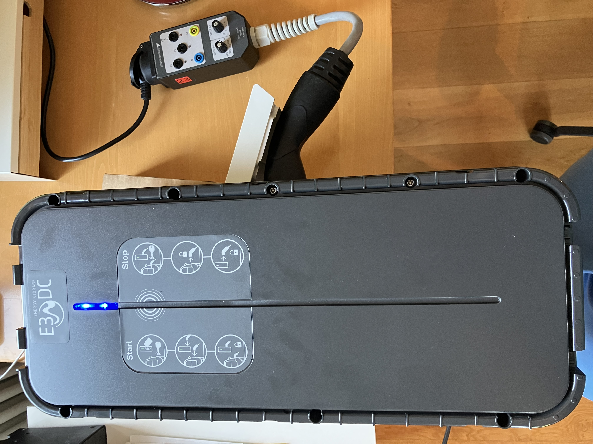

# E3/DC Multi Connect II Wallbox – Modbus TCP Register & direkte Steuerung

Dieses Projekt dokumentiert die nicht offiziell veröffentlichte **Modbus-TCP-Schnittstelle und die Modbus-Register der E3/DC Multi Connect II Wallbox (Multi Connect 2)**.

Ziel ist die **direkte Steuerung der Wallbox per Modbus TCP ohne E3/DC-Hauskraftwerk / EMC**. Dokumentiert werden unter anderem Register, Coils, Ladestatus, Ladestrom, Phasenumschaltung, RFID, interne Schnittstellen und getestete Schreibbefehle.

Die Ergebnisse stammen überwiegend aus eigenen Messungen und Funktionstests. Vermutungen und Fremdfunde werden ausdrücklich als solche gekennzeichnet.

Multi Connect 1
```
E3/DC Multi Connect Wallbox (Multi Connect 1) sollte baugleich sein und nur
für Schlüsselschalter und Schukosteckdose noch unbekannte Werte liefern
```

## Dokumentation

Die eigentliche Register- und Funktionsdokumentation befindet sich hier:

- [Direkte Modbus-TCP-Register und Funktionen](docs/modbus-register.md)
- [Interne Steckverbinder und Anschlussbelegung](docs/stecker.md)
- [IP-Symcon Modbus-Vorlage](templates/E3DC_Multi_Connect_II_Modbus.json)

Diese README beschreibt den **Testaufbau, die verwendete Hardware und die Modbus-Grundlagen des Tests**.

---

## Getestete Wallbox


**E3/DC Multi Connect II**

- Referenz / Typ: **XEV1K22T2E3DC**
- Mode 3
- Anschluss: **3P + N + PE**
- Nennstrom: **32 A**
- Spannung: **230 V 1~ / 400 V 3~**
- Leistungsklasse: **22 kW**
- Herstellungsdatum: **22.10.2024**
- Hersteller: **HagerEnergy GmbH**
- über Modbus ausgelesener Versionsstring: **7.0.5.0/1.0.2.0**

Die hier dokumentierten Ergebnisse beziehen sich auf genau dieses Testgerät bzw. diesen Firmwarestand.

---

## Verwendete Hardware und Software

### Prüfadapter

Verwendet wird ein **Gossen Metrawatt PRO-TYP II**.

Damit lassen sich die für die Tests benötigten Fahrzeugzustände reproduzierbar simulieren:

**CP – Control Pilot**

- A = kein Fahrzeug
- B = Fahrzeug angeschlossen, nicht ladebereit
- C = Fahrzeug angeschlossen und ladebereit
- D = Fahrzeug angeschlossen und ladebereit, Belüftung erforderlich
- E = Fehlerzustand

**PP – Proximity Pilot / Kabelstrom**

Am Prüfadapter wurden folgende Kabelströme simuliert:

- kein Kabel
- 13 A
- 20 A
- 32 A
- 63 A

Produktseite: [Gossen Metrawatt PRO-TYP II](https://www.gossenmetrawatt.de/produkte/pro-typ-i-i/)

### Lasttest

Für einen reproduzierbaren Lasttest wurde ein Wasserkocher mit ungefähr **2200 W** an der Prüfsteckdose des PRO-TYP II verwendet.

Zur Gegenmessung der von der Wallbox erfassten Phasenströme wird eine **BEHA AMPROBE AMP-310-EUR** Strommesszange verwendet.

Bei L1 wurden **8,24 A** mit der Strommesszange gemessen; gleichzeitig zeigte das zugeordnete Modbus-Register den Wert **82**. L2 und L3 wurden ebenfalls mit der Strommesszange gegengeprüft.

Die Detailzuordnung und Skalierung der Phasenstromregister wird in [docs/modbus-register.md](docs/modbus-register.md) geführt.

### S0-Energiezähler

Der Testaufbau wurde um einen **Eltako DSZ12D-3x65A** erweitert.

- Drehstromzähler 3x65 A
- S0-Ausgang
- **1000 Imp./kWh**
- S0-Ausgang potenzialfrei über Optokoppler
- Impulslänge laut Hersteller: **30 ms**

Der Zähler wird für die Untersuchung des internen S0-Anschlusses **J18** verwendet.

### RFID

Für den RFID-Test wurde eine Karte mit der aufgedruckten ID

```text
C08D62C4
```

verwendet.

Diese ID konnte vollständig in den Modbus-Registern wiedergefunden werden.


### Frontsensor / Kontakt-Sensor

An der Front befindet sich ein Kontakt-Sensor. Wird er etwa **1–4 Sekunden** betätigt, setzt die Wallbox **Coil 5 auf TRUE**. Ein weiterer Tastvorgang setzt Coil 5 nicht zurück. Wird Coil 5 per Modbus auf FALSE gesetzt, kann der Frontsensor ihn anschließend erneut auf TRUE setzen.

Die Hager-Anleitung beschreibt den Kontakt-Sensor bei aktiver Solaroptimierung als Funktion zum Beschleunigen des Ladevorgangs. Die genaue Rücksetzlogik und das Zusammenspiel mit Register 40083 sind noch offen.

### Interne Taster BP1

Auf beiden Platinen der Wallbox befindet sich jeweils ein Taster mit der Bezeichnung **BP1**.

Beide Taster wurden betätigt. Dabei wurde **keine beobachtbare Änderung** am Verhalten der Wallbox bzw. an den während des Tests überwachten Modbus-Werten festgestellt.

Die Funktion der beiden BP1-Taster ist damit weiterhin **unbekannt**.


### Interne Steckverbinder

Die geprüfte interne Verkabelung, bekannte Pinbelegungen und noch offene Steckverbinder sind auf einer eigenen Seite dokumentiert:

- [Interne Steckverbinder und Anschlussbelegung](docs/stecker.md)

### Software

Für die Untersuchung wurden verwendet:

- **Modbus Poll** für gezielte Lese-/Schreibtests
- **IP-Symcon** für die spätere praktische Einbindung und Schaltversuche
- Modbus TCP direkt zur Wallbox

---

## Modbus-Verbindung

Getestete Kommunikationsparameter:

- Modbus TCP
- TCP-Port: **502**
- Unit / Slave ID: **1**

### Adressierung

Modbus-PDU und IP-Symcon arbeiten bei den Holding Registern 0-basiert.

In der Registerdokumentation wird zur besseren Lesbarkeit die klassische **40001-Darstellung** verwendet.

| PDU / IP-Symcon | Dokumentation |
|---:|---:|
| 0 | 40001 |
| 80 | 40081 |
| 82 | 40083 |
| 101 | 40102 |

**40000 wird nicht als eigenes Register geführt.**  
PDU-Adresse 0 entspricht in dieser Dokumentation **40001**.

---

## Verwendete Modbus-Funktionen

Im bisherigen Test wurden verwendet:

- **FC01** – Read Coils
- **FC02** – Read Discrete Inputs
- **FC03** – Read Holding Registers
- **FC04** – Read Input Registers
- **FC05** – Write Single Coil
- **FC06** – Write Single Register
- **FC16** – Write Multiple Registers

Welche Adressen tatsächlich schreibbar sind und welche Funktion dahinter steckt, wird ausschließlich in [docs/modbus-register.md](docs/modbus-register.md) geführt.

---

## Kennzeichnung der Ergebnisse

In der Detaildokumentation werden die Ergebnisse so gekennzeichnet:

- **Verifiziert** – am eigenen Gerät reproduzierbar getestet
- **Hypothese** – technisch plausibel, aber noch nicht vollständig gegengeprüft
- **Fremdquelle** – Bedeutung stammt aus einer externen Quelle und wurde noch nicht vollständig selbst bestätigt
- **RO** – lesbar, Schreibzugriff wurde abgewiesen bzw. nicht vorgesehen
- **RW** – Lesen und Schreiben wurden praktisch bestätigt

---

## Quellen zum Testaufbau

### Hager / E3/DC

[Hager Installationsanleitung witty solar XEV1K22T2S / XEV1K07T2S](https://assets.hager.com/step-content/P/HA_39675796/Document/std.lang.all/6LE009000B_XEV1KXX2S_EVCS_WITTY-SOLAR_MANUAL_DE_WEB.pdf)

Verwendet unter anderem für die Einordnung des I-Max-Drehkodierschalters und der Stromstufen.

### Prüfadapter

[Gossen Metrawatt PRO-TYP II](https://www.gossenmetrawatt.de/produkte/pro-typ-i-i/)

Verwendet für CP-Zustände, PP-Kabelsimulation und reproduzierbare Fahrzeugsimulation.

---

## Hinweis

Es handelt sich um **Reverse Engineering einer nicht offiziell dokumentierten direkten Modbus-Schnittstelle**. Die beschriebenen Funktionen beziehen sich auf das oben genannte Testgerät und den getesteten Firmwarestand. Andere Firmwarestände oder Hardwarevarianten können sich anders verhalten.


---

## Lizenz

Dieses Projekt ist ausdrücklich zum **Nachbauen, Weiterentwickeln, Forken und Verbessern** gedacht.

Die Nutzung, Änderung und Weitergabe ist für **nicht-kommerzielle Zwecke** erlaubt. Kommerzielle Nutzung, Verkauf, entgeltliche Dienstleistungen oder die Integration in kommerzielle Produkte und Angebote sind ohne separate schriftliche Erlaubnis nicht gestattet.

Weiterentwicklungen und Forks sind ausdrücklich erwünscht. Bei einer Weitergabe oder Veröffentlichung von Änderungen müssen der ursprüngliche Urheberhinweis und diese Lizenz erhalten bleiben.

Die vollständigen Bedingungen stehen in der Datei [LICENSE](LICENSE).
